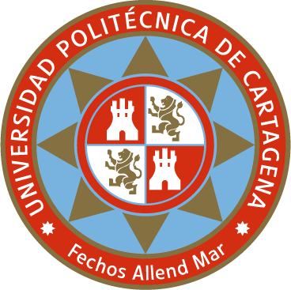

    <h1><strong>UNIVERSIDAD POLITÉCNICA DE CARTAGENA</strong></h1>
    <h2><strong>GRADO EN CIENCIA E INGENIERÍA DE DATOS</strong></h2>

        
    

<h2><strong>Procesamiento del Lenguaje Natural</strong></h2>

<h3><strong>PROYECTO</strong> 
    <strong>Reddit Insights: Aplicación PLN para diversos análisis textuales avanzados.</strong></h3>

<strong>ESTUDIANTES</strong>

    <ul style="list-style-type:none; padding: 0;">
        <li><strong>Rubén Gil Martínez<strong></li>
        <li><strong>Guillermo López Pérez<strong></li>
    </ul>

